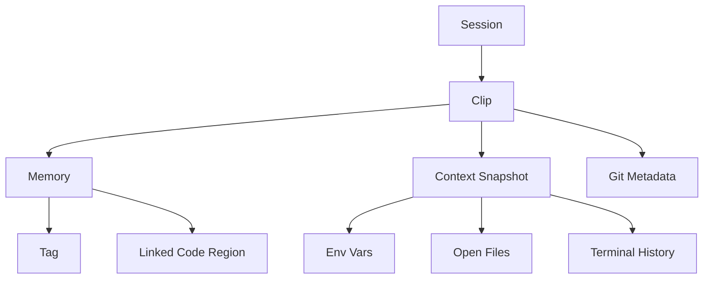

# crecall Adaptation & Use-Case Brainstorm

## Core Value Summary
crecall captures, structures, and restores development/session context ("clips" and "memories") with minimal friction. This foundation can be generalized to any domain where temporal context, decision chains, and recoverability matter.

## High-Impact Adaptations

### 1. Developer Productivity Platform
- **Context Injection for AI**: Provide structured recent clips + curated memories as prompt enrichment for code assistants.
- **Pair Programming Timeline**: Shared session timeline across remote collaborators, replay decisions chronologically.
- **PR Memory Bundles**: Attach relevant memories (design decisions, trade-offs) directly to pull requests.
- **Onboarding Packs**: Generate a "memory export" for new team members (key decisions, setup steps, tribal knowledge).

### 2. Incident Response & Operations
- **Live Ops Console**: Record terminal commands, environment changes, and config diffs as memories during incidents.
- **Postmortem Automation**: Auto-generate timeline and contributing factors from clips.
- **Rollback Readiness**: Create pre-change clips; enable one-click restore of env state.
- **Compliance Trail**: Tamper-evident log of actions + encrypted sensitive contexts.

### 3. Data Science / Research Journals
- **Experiment Versioning**: Each run becomes a clip (dataset, parameters, metrics snapshot).
- **Hypothesis Tracking**: Memories store assumptions, outcomes, pivot points.
- **Repro Pipelines**: Restore clip to recreate notebook/kernel/file set instantly.
- **Result Comparison**: Diff two experiment clips (model metrics, config deltas).

### 4. Secure Knowledge Vault / PKM
- **Semantic Recall**: Query memories by meaning (embedding + retrieval pipeline).
- **Source-of-Truth Threads**: Link related memories into narrative bundles.
- **Context Aging**: Deprioritize old or obsolete memories via decay scoring.
- **Redaction Layer**: Field-level encryption for sensitive memory fragments.

### 5. Learning & Skill Acquisition
- **Practice Sessions**: Capture coding drills; restore state to retry improved approaches.
- **Progress Replay**: Show evolution of abilities via structured clip timeline.
- **Goal Anchoring**: Tag pivotal milestones ("first passing test", "refactored module X").
- **Adaptive Guidance**: Recommend next tasks based on memory gaps.

### 6. Legal / Audit / Compliance
- **Immutable Ledger Mode**: Append-only encrypted clip chain (hash-linked like git).
- **Action Justification**: Each memory annotated with policy or ticket reference.
- **Selective Disclosure**: Export sanitized timeline (automated PII filtering).
- **Retention Policies**: Automatic pruning + compliance archival buckets.

### 7. Enterprise Knowledge Graph
- **Memory Graph Model**: Nodes (clips, sessions, decisions), edges (depends-on, supersedes, related-to).
- **Impact Analysis**: Query downstream dependencies of a design change.
- **Domain Reasoning**: Feed structured graph into LLM for advanced Q&A.
- **Cross-Team Alignment**: Shared hub of codified tribal knowledge.

### 8. Cognitive Workflow Augmentation
- **Attention Assist**: Detect context switching frequency from clip cadence.
- **Focus Mode**: Auto-suppress low-importance memory capture for deep work.
- **Fatigue Signals**: Highlight error-prone command bursts or thrashing patterns.
- **Adaptive Autosave**: Increase clip frequency during high-volatility periods.

### 9. Continuous Architecture Governance
- **Architecture Drift Detection**: Compare current session state vs. baseline structural memory.
- **Decision Traceability**: Link code changes to recorded rationale memories.
- **Standards Enforcement**: Flag clips missing required compliance annotations.
- **Refactor Planning**: Aggregate stale or conflicting memory clusters.

### 10. Hybrid Local/Cloud Execution
- **Edge Sync**: Local clip capture → encrypted sync to cloud store.
- **Offline Mode**: Full recall capabilities without network; later merges memory diff.
- **Conflict Resolution**: 3-way merge of diverged memory timelines.
- **Federated Insight**: Aggregate anonymized memory patterns across org.

## Feature Evolution Roadmap (Adaptable Backbone)
| Phase | Foundational Concept | Adaptable Outcome |
|-------|----------------------|-------------------|
| 1 | Clips & Memories | Immutable context ledger |
| 2 | Search & Tags | Semantic retrieval layer |
| 3 | Linking & Diffs | Knowledge graph + reasoning substrate |
| 4 | Autosave Intelligence | Cognitive load optimization |
| 5 | Export/Import | Interoperability with AI ecosystems |
| 6 | Multi-Session Orchestration | Distributed collaborative timeline |

## Positive Outcome Matrix
| Stakeholder | Benefit | Mechanism |
|-------------|---------|-----------|
| Individual Dev | Faster resumption post-interruption | One-click clip restore |
| Team Lead | Better visibility into workflow bottlenecks | Timeline analytics |
| SRE | Rapid incident reconstruction | Structured memory auto-capture |
| Security | Auditable change provenance | Encrypted chained clips |
| Data Scientist | Reproducible experiments | Clip-based environment snapshots |
| New Hire | Accelerated onboarding | Curated memory export |
| AI System | High-quality contextual grounding | Structured clip + memory feed |
| Compliance | Traceable operational decisions | Immutable log discipline |

## AI Enablement Opportunities
- **Retrieval-Augmented Generation (RAG)**: Use memory embeddings as dynamic knowledge layer for coding assistants.
- **Prompt Orchestration**: Auto-build context windows from latest clip + top-K relevant memories.
- **Insight Mining**: Cluster memory topics → surface latent themes (e.g. persistent build failures).
- **Predictive Recall**: Suggest restoring to earlier clip before risky operation (heuristic risk model).

## Data Model Extensions

## Monetization / Sustainability Ideas
- **Pro Tier**: Encrypted cloud sync, multi-device restore.
- **Team Dashboard**: Aggregate session heatmaps, churn detectors.
- **Enterprise Compliance Pack**: Immutable ledger mode + export pipelines (JSON-LD, SIEM feed).
- **AI Context API**: Paid endpoint delivering enriched prompt payloads.

## Risk Mitigations
| Risk | Mitigation |
|------|------------|
| Sensitive data leakage | Field-level encryption + redaction policies |
| Performance overhead | Incremental diff clips + adaptive capture cadence |
| User overwhelm | Progressive disclosure UI (basic vs. advanced) |
| Data bloat | Pruning, compression, archivable cold storage |
| Trust erosion | Verifiable hash chain + integrity proofs |

## Strategic Integrations
- **Git**: Pre/post commit hooks enrich clip metadata.
- **VS Code**: Live context panel + quick recall palette.
- **Container Orchestrators**: Clip Kubernetes pod state before deploy.
- **Issue Trackers**: Attach decision memories to tickets automatically.
- **Secrets Managers**: Fetch encryption keys securely (Vault, AWS KMS).

## Future Research Directions
- **Semantic Diff of Clips**: Not just file changes—intent + behavior difference.
- **Temporal Memory Decay Functions**: Optimize retrieval relevance over time.
- **Autonomous Context Agents**: Agents curate, summarize, and consolidate noisy memories.
- **Cross-User Knowledge Weaving**: Detect shared patterns and propose reusable workflows.

## Immediate Next Adaptable Enhancements
1. Memory embeddings + vector search (lay groundwork for semantic recall).
2. Clip size optimization via structural hashing / deduplication.
3. Knowledge pack export (Markdown + graph JSON bundle).
4. VS Code sidebar with timeline scrubbing & instant diff preview.
5. API endpoint for AI assistants: /api/context/suggest?goal=refactor

---
**Summary:** crecall’s abstractions (clip, memory, session) generalize cleanly into a universal context capture + recovery + intelligence layer. This enables productivity, reliability, auditability, and AI augmentation across multiple verticals.
